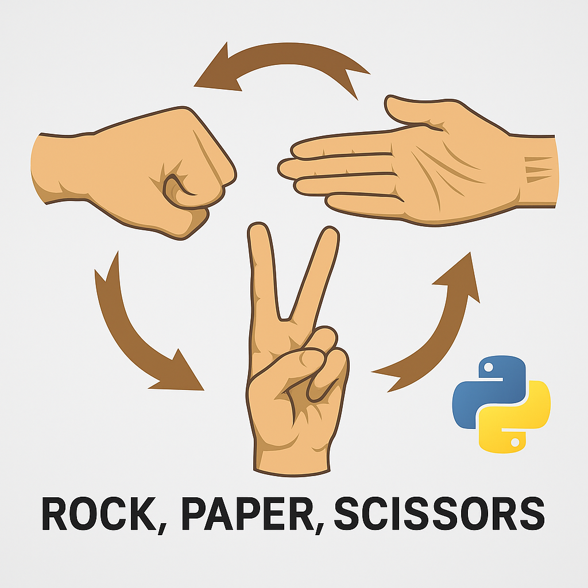

<p align="center">
  
</p>

# 🎮 Rock, Paper, Scissors Game

This is a simple implementation of the classic Rock, Paper, Scissors game in Python. The game allows a user to play against the computer, keeping track of winners and providing a fun interactive experience.

## Project Structure
```
rock-paper-scissors/
├── src/
│   └── game.py
└── README.md
```
## Prerequisites
- Python 3.x
- No additional libraries required
## How to Run the Game
1. Clone the repository or download the source code.
2. Run the game using Python:
   ```bash
   python src/game.py
   ```
3. Follow the on-screen prompts to play the game.
## How to Play
- Enter your name when prompted.
- Choose your move: Rock, Paper, or Scissors.
- The computer will randomly select its move.
- The game will determine the winner and display the results.   
- You can choose to play again or exit the game.
## Example Gameplay
```
Welcome to Rock, Paper, Scissors!
What is your name? Alice
Alice, enter your choice (['rock', 'paper', 'scissors']): ro
Alice, enter a right choices of ['rock', 'paper', 'scissors']: Rock
Your choice was: rock
Computer choice was: scissors
Congratulations Alice! You WIN
Do you want to play again? (Enter any key to continue, otherwise press q/Q to exit)rr
Alice, enter your choice (['rock', 'paper', 'scissors']): rock
Your choice was: rock
Computer choice was: paper
OH, sorrry, maybe you will win next time!...
Do you want to play again? (Enter any key to continue, otherwise press q/Q to exit)yes
Alice, enter your choice (['rock', 'paper', 'scissors']): rock
Your choice was: rock
Computer choice was: rock
It`s a tie!
Do you want to play again? (Enter any key to continue, otherwise press q/Q to exit)q
Thank you for playing! Goodbye!
```
## Future Enhancements
- Add a scoring system to keep track of wins, losses, and ties.
- keep a specific number of rounds to determine the overall winner.
- Implement a graphical user interface (GUI) for a more engaging experience.
- Introduce additional game modes or variations, such as Rock, Paper, Scissors, Lizard, Spock.
- Allow multiplayer functionality for two players.
